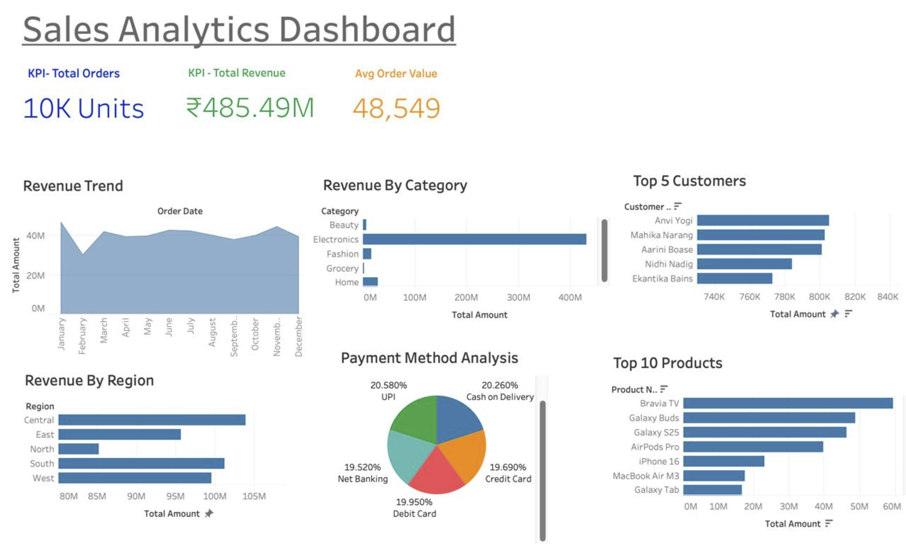

# 📊 Customer Value & Marketing ROI Analysis

## Overview

This project demonstrates an end-to-end Business Analytics workflow using Python, SQL, MySQL, and Tableau.

The project covers:

- Data Generation
- Data Cleaning
- Database Design
- SQL Business Analysis
- KPI Analysis
- Interactive Tableau Dashboard

---

## Tech Stack

- Python
- Pandas
- Faker
- MySQL
- SQL
- Tableau
- Git
- GitHub

---

## Project Structure

```
Customer_Value_Marketing_ROI
│
├── dashboard/
├── data/
├── notebook/
├── sql/
├── reports/
├── requirements.txt
└── README.md
```

---

## Dashboard



---

## Key Business KPIs

- Total Revenue
- Total Orders
- Average Order Value
- Revenue by Category
- Revenue by Region
- Payment Method Analysis
- Top Customers
- Top Products

---

## Author

**Dheeraj Sankhla**